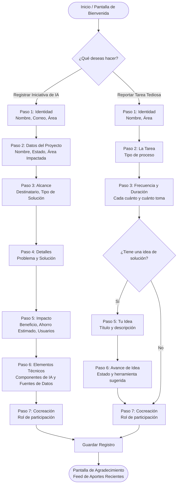

# 📊 Flujo Dinámico del Cuestionario Ikusi

Este documento describe la estructura y lógica del nuevo cuestionario híbrido unificado para la captura de iniciativas de Inteligencia Artificial y la detección de tareas repetitivas en **Ikusi**.

---

## 🗺️ Mapa de Navegación del Usuario

A continuación se muestra cómo el usuario navega dinámicamente a través de las pantallas según sus respuestas:

---

## 📝 Detalle de los Flujos de Preguntas

### 1. Pantalla de Bienvenida (Común)
- Mensaje empático sobre la optimización del tiempo para tareas de valor.
- Botones de selección de flujo principal.

---

### 🟢 Camino A: Registrar Iniciativa/Desarrollo de IA (PDF Flow)

Este camino está diseñado para capturar soluciones que ya han sido desarrolladas o están en proceso activo de creación.

| Paso | Pregunta | Tipo de Control | Opciones / Descripción |
| :--- | :--- | :--- | :--- |
| **1. Identidad** | ¿Quién lidera o participa en esta iniciativa? | Texto, Email, Selector | Nombre, Email corporativo, Área de Ikusi. |
| **2. Datos del Proyecto** | Cuéntanos sobre la iniciativa | Texto, Selector | Nombre de la iniciativa, Estado actual (Idea / PoC / Desarrollo / Implementado), Área principal impactada. |
| **3. Alcance** | ¿A quién sirve y qué tipo de solución es? | Selector | Destinatario (Interno/Externo/Proveedor/Mixto), Tipo de solución (Chatbot / Automatización / Dashboard / Agente IA / etc.). |
| **4. Detalles** | ¿Qué problema resuelve y cómo funciona? | Textarea | Descripción del problema específico y funcionamiento de la solución. |
| **5. Impacto** | ¿Qué beneficios aporta tu solución? | Selector, Numérico | Beneficio principal, Ahorro estimado de tiempo por ejecución (número + unidad) y cantidad de usuarios estimados. |
| **6. Tecnología** | ¿Qué herramientas y fuentes utiliza? | Multiselección (Chips) | **Componentes:** GPT, Claude, Copilot, OCR, etc. **Fuentes:** SharePoint, Base de datos, ERP, CRM, etc. |
| **7. Cocreación** | ¿Quieres seguir participando en este proyecto? | Botón de selección | Rol propuesto por el usuario (Liderar / Apoyar / Solo aportar). |

---

### 🟡 Camino B: Reportar una Tarea Repetitiva (HTML Flow)

Este camino está diseñado para que cualquier colaborador reporte procesos manuales que le consumen tiempo improductivo, tenga o no una solución tecnológica pensada.

| Paso | Pregunta | Tipo de Control | Opciones / Descripción |
| :--- | :--- | :--- | :--- |
| **1. Identidad** | ¿Quién reporta este proceso? | Texto, Selector | Nombre y Área de Ikusi. |
| **2. La Tarea** | ¿Qué tarea repetitiva te quita más tiempo? | Botón de selección | Copiar y pegar, reportes, mantener Excel, responder correos, buscar datos en múltiples herramientas, otra. |
| **3. Frecuencia** | ¿Cada cuánto la realizas y cuánto te toma? | Selector, Numérico | Frecuencia (diaria, semanal, etc.) y Duración estimada por ejecución (número + unidad). |
| **4. Solución** | ¿Tienes una idea de cómo se podría automatizar? | Botón de selección | Sí (continúa al paso 5) / No (salta al paso 7). |
| **5. Tu Idea** | ¿En qué consiste tu idea? | Texto, Textarea | Título y descripción corta de la propuesta de mejora. |
| **6. Avance** | ¿Cuál es el estado de esta idea? | Selector | Nivel de avance (Idea conceptual / Prototipo / En uso) y Herramienta utilizada o sugerida. |
| **7. Cocreación** | ¿Quieres ser parte de la solución? | Botón de selección | Rol propuesto por el usuario (Programar / Acompañar / Solo reportar). |

---

## 💾 Persistencia de Datos Unificada

Ambos caminos se guardan en la misma tabla de base de datos (`submissions`), facilitando el análisis conjunto y la exportación unificada a CSV/Excel en el Panel de Administración:

- Las respuestas de la **Rama A** tendrán los campos de la **Rama B** como nulos (excepto los campos comunes como nombre y área).
- Las respuestas de la **Rama B** completarán los campos específicos de tareas repetitivas.
- El campo `type` identifica el origen de la respuesta para organizar los gráficos automáticos.
